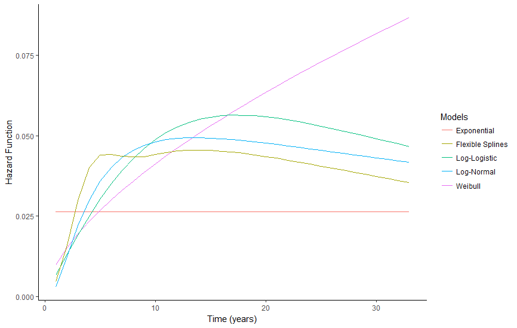

[](http://quantlet.de/)

## [](http://quantlet.de/) **ComparHaz**
```yaml

Name of QuantLet : ComparHaz

Published in : SPL

Description : 'Compare estimated hazard function for five different models: Exponential model, 
	       Model with flexible splines, log-logistic model, log-normal model and Weibull model. 
               The graph shows the transitioning into homeownership'
	      
Keywords : 'survival analysis, non-parametric estimation, semi-parametric estimation, 
            hazard rate, Kaplan Meier, R'

Author : Alice Drube, Konstantin Göbler, Chris Kolb, Richard v. Maydell
```

### R Code
```R

rm(list = ls())

# set working directory setwd('C:/...') setwd('~/...') # linux/mac os
# setwd('/Users/...') # windows

# load packages
libraries = c("survival", "rms", "survminer", "dplyr", "readr", "flexsurv", 
  "ggfortify", "ggplot2")
lapply(libraries, function(x) if (!(x %in% installed.packages())) {
  install.packages(x)
})
lapply(libraries, library, quietly = TRUE, character.only = TRUE)

# load dataset
load("datfinal.RDA")

# define formula
coxsurv = Surv(dat$time, dat$event, type = "right")
coxform = as.formula("coxsurv ~ hhinc + rural + maxedu + region + migback + 
  married + ever_div")
dat = within(dat, {
  rural = factor(rural, labels = c("urban", "rural"))
  region = factor(region, labels = c("west", "east"))
  migback = factor(migback, labels = c("No", "Yes"))
  married = factor(married, labels = c("No", "Yes"))
  ever_div = factor(ever_div, labels = c("No", "Yes"))
})
cox.ph = coxph(coxform, data = dat)
# define survival object
coxparm = Surv(dat$time, dat$event, type = "right")

# define model formula
parmform = as.formula("coxparm ~ hhinc + rural + maxedu + region + migback + 
  married + ever_div")
# Kaplan-Meier estimator
kapm = survfit(coxparm ~ 1, data = dat)
# puts survival table from kapm object into a data frame
kap.dat = fortify(kapm)
# fortify cox model output
cox.dat = fortify(survfit(cox.ph, conf.int = F))

# Exponential distribution
expo = flexsurvreg(formula = parmform, data = dat, dist = "exp")
# Weibull distribution
weibull = flexsurvreg(formula = parmform, data = dat, dist = "weibull")
# Log-Logistic distribution
loglog = flexsurvreg(formula = parmform, data = dat, dist = "llogis")
# Log-normal distribution
lnormal = flexsurvreg(formula = parmform, data = dat, dist = "lnorm")
# Flexible splines (Royston and Parmar 2002)
flex.spline = flexsurvspline(coxparm ~ 1, data = dat, k = 2, scale = "odds")

# only hazard functions as single plot
ggplot(data.frame(summary(expo, type = "hazard")), aes(x = time)) + 
  geom_line(aes(y = est, col = "Exponential")) + 
  geom_line(data = data.frame(summary(weibull, type = "hazard")), 
  aes(y = est, col = "Weibull")) + 
  geom_line(data = data.frame(summary(loglog, 
  type = "hazard")), aes(y = est, col = "Log-Logistic")) + 
  geom_line(data = data.frame(summary(lnormal, 
  type = "hazard")), aes(y = est, col = "Log-Normal")) + 
  geom_line(data = data.frame(summary(flex.spline, 
  type = "hazard")), aes(y = est, col = "Flexible Splines")) + 
  labs(x = "Time (years)", 
  y = "Hazard Function", col = "Models") + theme_classic()
```
