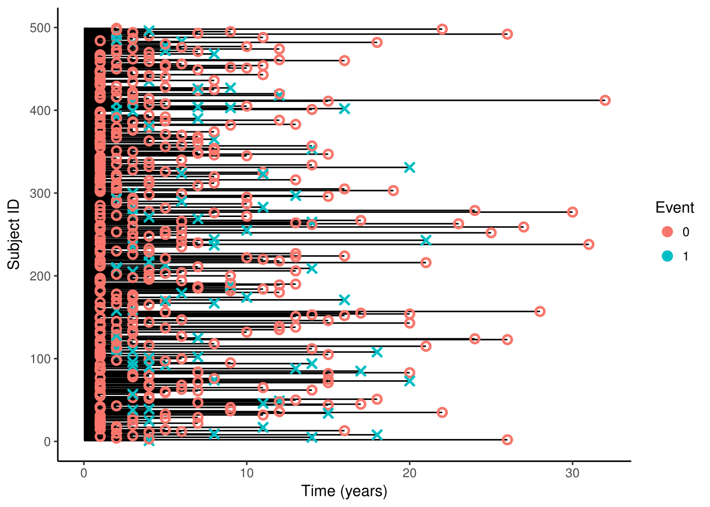

[](http://quantlet.de/)

## [](http://quantlet.de/)**DataVisualization** [](http://quantlet.de/)

```YAML
Name of QuantLet : DataVisualization

Published in : SPL

Description : 'Provide some graphs for a better understanding of the data.
               Visualization of survival time for randomly drawn individuals - support 
               the need of statistical models that account for censoring '
	      
Keywords : 'survival analysis, non-parametric estimation, semi-parametric estimation, 
            hazard rate, Kaplan Meier, R'

Author : Alice Drube, Konstantin Göbler, Chris Kolb, Richard v. Maydell
```


### R Code
```R
rm(list = ls())

# set working directory setwd('C:/...') 
# setwd('~/...') # linux/mac os
# setwd('/Users/...') # windows


# install and load packages
libraries = c("survival", "rms", "survminer", "dplyr", "readr", "ggplot2")
lapply(libraries, function(x) if (!(x %in% installed.packages())) {
  install.packages(x)
})
lapply(libraries, library, quietly = TRUE, character.only = TRUE)

# load dataset
load("datfinal.RDA")

##################################################################################
#### Data structure visualization ################################################
##################################################################################

# permutate persID to get rid of pnr (=syear) dependencies in surv. time
dat.str <- dat
dat.str$pnr <- sample(1:nrow(dat), nrow(dat), replace=F)
dat.str1 <- subset(dat.str, pnr<500)

ggplot(dat.str1, aes(x = pnr, y = time)) +
  geom_linerange(aes(ymin = 0, ymax = time), size=0.5) +
  geom_point(aes(shape = as.factor(event), color = as.factor(event)), stroke = 1.3, cex = 2) +
  scale_shape_manual(values = c(1,4))  + labs(color="Event") + guides(shape=F) +
  labs(y = "Time (years)", x = "Subject ID") + coord_flip() + theme_classic()

```
