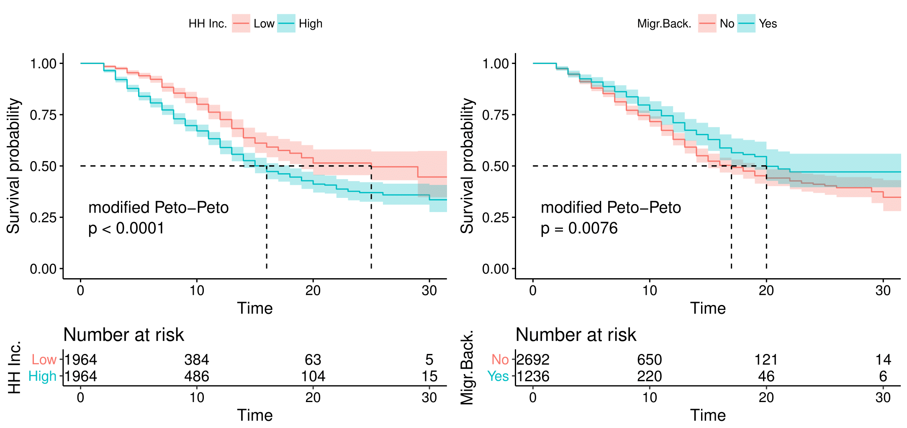
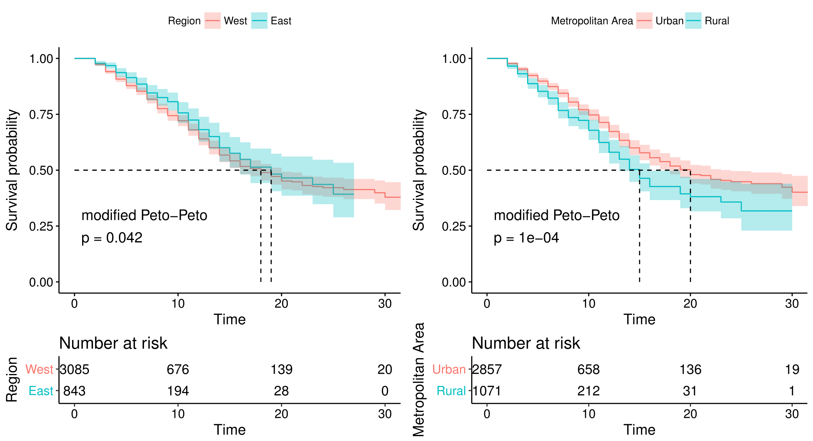
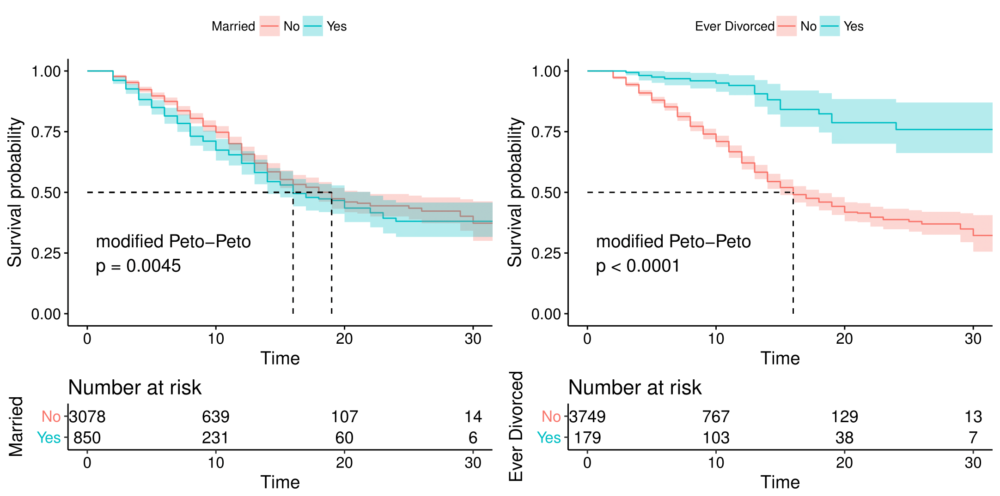
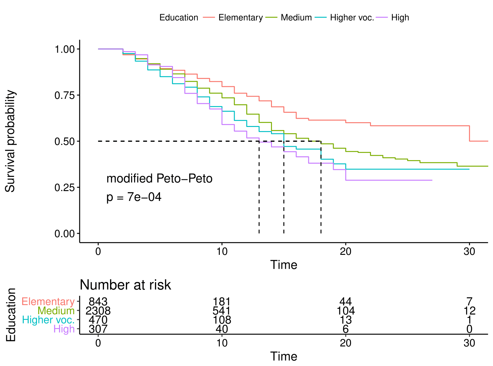

[](http://quantlet.de/)

## [](http://quantlet.de/) **GroupKM** [](http://quantlet.de/)

```yaml

Name of QuantLet : GroupKM

Published in : SPL

Description : 'Function for graphically appealing plots of Kaplan-Meier estimates for survival in rent
	       Compare different subgroups: Region East/West, Region Urban/Rural, Household Income High/Low, 
	       Migration Background Yes/No, Married Yes/No, Divorced Yes/No, Education'

Keywords : 'survival analysis, non-parametric estimation, semi-parametric estimation, 
            hazard rate, Kaplan Meier, R'

Author : Alice Drube, Konstantin Göbler, Chris Kolb, Richard v. Maydell

```





### R Code 

```R
rm(list = ls())

# set working directory setwd('C:/...') 
# setwd('~/...') # linux/mac os
# setwd('/Users/...') # windows

# install and load packages
libraries = c("survival", "ggplot2", "survminer")
lapply(libraries, function(x) if (!(x %in% installed.packages())) {
  install.packages(x)
})
lapply(libraries, library, quietly = TRUE, character.only = TRUE)

# load dataset
load("datfinal.RDA")

############################################################################### 
###KM by strata#### Function for Kaplan Meier Curves by Strata ################
###############################################################################
###############################################################################

### Storing survObject, labs= category description, Legend Title
kmGroupKurves = function(labs, title, line = c(1, 1), conf = T) {
  ggsurvplot(wide.fit, conf.int = conf, legend.labs = labs, 
  legend.title = title, censor = F, palette = "strata", risk.table = T, 
  pval = TRUE, pval.method = TRUE, log.rank.weights = "S2", 
  risk.table.height = 0.25, ylim = c(0, 1), xlim = c(0,30), 
  surv.median.line = "hv",linetype = line, size = 0.5)
}

# KM by gender ################################################################ 
# = male, 1 = female
wide.fit = survfit(Surv(time, event, type = "right") ~ gender, data = dat)

km.sex = kmGroupKurves(c("Male", "Female"), "Gender")

rm(wide.fit)

# KM by Metropolitan Area ##################################################### 
# = Urban, 1 = Rural
wide.fit = survfit(Surv(time, event, type = "right") ~ rural, data = dat)

km.urban = kmGroupKurves(c("Urban", "Rural"), "Metropolitan Area")

rm(wide.fit)

# KM by married divorced ######################################################

wide.fit = survfit(Surv(time, event, type = "right") ~ ever_div, data = dat)

km.div = kmGroupKurves(c("No", "Yes"), "Ever Divorced")


wide.fit = survfit(Surv(time, event, type = "right") ~ married, data = dat)

km.marr = kmGroupKurves(c("No", "Yes"), "Married")


rm(wide.fit)

# KM by region ################################################################

wide.fit = survfit(Surv(time, event, type = "right") ~ region, data = dat)

km.reg = kmGroupKurves(c("West", "East"), "Region")

rm(wide.fit)


# KM by migback ###############################################################

wide.fit = survfit(Surv(time, event, type = "right") ~ migback, data = dat)

km.mig = kmGroupKurves(c("No", "Yes"), "Migr.Back.")

rm(wide.fit)


# KM by highinc/lowinc ########################################################

medinc = median(as.numeric(dat$hhinc), na.rm = TRUE)
dat.inc = mutate(dat, highinc = ifelse(dat$hhinc > medinc, 1, 0))
summary(dat.inc$highinc)
# define survival object and fit KM estimator
wide.fit = survfit(Surv(time, event, type = "right") ~ highinc, data = dat.inc)

km.inc = kmGroupKurves(c("Low", "High"), "HH Inc.")

rm(wide.fit, medinc, dat.inc)


# KM by educ (ISCED 97) #######################################################

# define survival object and fit KM estimator
wide.fit = survfit(Surv(time, event, type = "right") ~ educ, data = dat)

km.edu = kmGroupKurves(c("Elementary", "Medium", "Higher voc.", "High"), 
  "Education", line = c(1, 1, 1, 1), conf = F)

rm(wide.fit)

# KM by cohorts 84-87 and 94-97 ###############################################

dat = mutate(dat, cohort8494 = ifelse(dat$firstyear <= 1987, 1, 
  ifelse(dat$firstyear >= 1994 & dat$firstyear <= 1997, 2, NA)))
summary(dat$cohort8494)
table(dat$cohort8494)
# define survival object and fit KM estimator
wide.fit = survfit(Surv(time, event, type = "right") ~ cohort8494, data = dat)

km.coh = kmGroupKurves(c("84-87", "94-97"), "Cohorts")

rm(wide.fit)

km.glist1 = list(km.inc, km.mig)

km.plot1 = arrange_ggsurvplots(km.glist1, ncol = 2, nrow = 1, print = FALSE, 
  risk.table.height = 0.25, surv.plot.height = 1)


km.glist2 = list(km.reg, km.urban)

km.plot2 = arrange_ggsurvplots(km.glist2, ncol = 2, nrow = 1, print = FALSE, 
  risk.table.height = 0.25, surv.plot.height = 1)

km.glist3 = list(km.marr, km.div)
km.plot3 = arrange_ggsurvplots(km.glist3, ncol = 2, nrow = 1, print = FALSE, 
  risk.table.height = 0.25, surv.plot.height = 1)
print(km.plot1)
print(km.plot2)
print(km.plot3)
print(km.edu)
```
