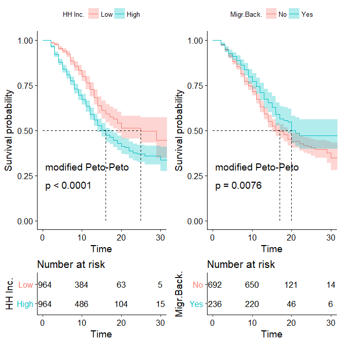
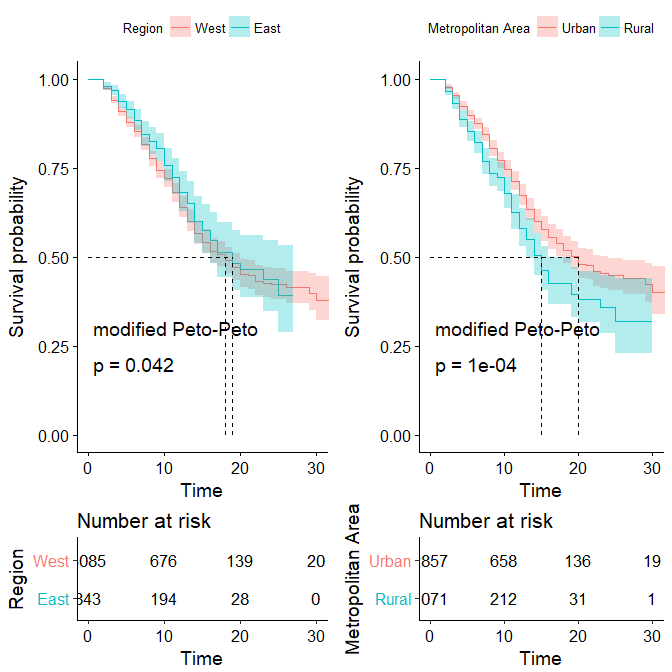
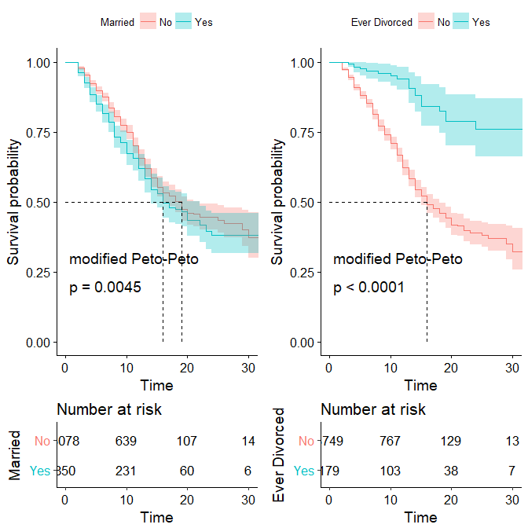

[](http://quantlet.de/)


```yaml

Name of QuantLet : 

Published in : SPL

Description : 
	      
              


Keywords : 'survival analysis, non-parametric estimation, semi-parametric estimation,
	    hazard rate, Kaplan Meier'

Author : Alice Drube, Konstantin Göbler, Chris Kolb, Richard v. Maydell
```





### R
```R
```
