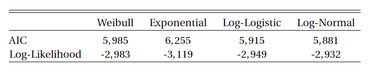

[](http://quantlet.de/)


## [](http://quantlet.de/) **InfCrit_Surv**
```yaml

Name of QuantLet : InfCrit_Surv

Published in : SPL

Description : 'Use the Akaike Information Criterion to perform appropriate model selection 
              (for models estimated via Maximum Likelihood Estimation).
               Report of the respective AIC values for each of the models.'

Keywords : 'survival analysis, non-parametric estimation, semi-parametric estimation, 
            AIC, Maximum Likelihood, R'

Author : Alice Drube, Konstantin Göbler, Chris Kolb, Richard v. Maydell

```


### R Code

```R
rm(list = ls())

# set working directory setwd('C:/...') setwd('~/...') # linux/mac os
# setwd('/Users/...') # windows


# install and load packages
libraries = c("survival", "rms", "survminer", "dplyr", "stargazer", "flexsurv", 
  "readr", "ggplot2")
lapply(libraries, function(x) if (!(x %in% installed.packages())) {
  install.packages(x)
})
lapply(libraries, library, quietly = TRUE, character.only = TRUE)

# load dataset
load("datfinal.RDA")

# define survival object
coxparm = Surv(dat$time, dat$event, type = "right")

# define model formula
parmform = as.formula("coxparm ~ hhinc + rural + maxedu + region + migback + 
  married + ever_div")


# Weibull distribution
weibull = flexsurvreg(formula = parmform, data = dat, dist = "weibull")

# Exponential distribution
expo = flexsurvreg(formula = parmform, data = dat, dist = "exp")

# Log-Logistic distribution
loglog = flexsurvreg(formula = parmform, data = dat, dist = "llogis")

# Log-normal distribution
lnormal = flexsurvreg(formula = parmform, data = dat, dist = "lnorm")

# AIC for parametric models (model selection)

AICs = matrix(data = NA, nrow = 4, ncol = 2)
AICs[1, 1] = weibull$AIC
AICs[1, 2] = weibull$loglik

AICs[2, 1] = expo$AIC
AICs[2, 2] = expo$loglik

AICs[3, 1] = loglog$AIC
AICs[3, 2] = loglog$loglik

AICs[4, 1] = lnormal$AIC
AICs[4, 2] = lnormal$loglik

rownames(AICs) = c("Weibull", "Exponential", "Log-Logistic", "Log-Normal")
colnames(AICs) = c("AIC", "Log-Likelihood")
t(AICs)

# Log-normal has best fit
stargazer(t(AICs), out = "aic.tex", digits=0)
```
