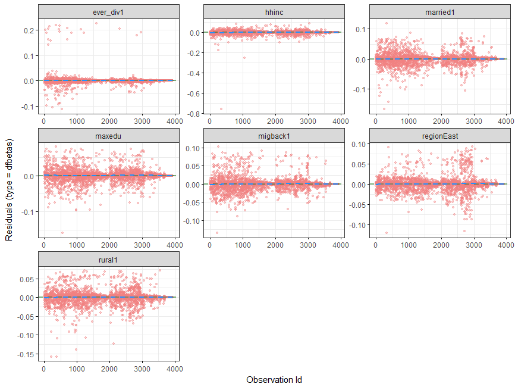

[](http://quantlet.de/)

## [](http://quantlet.de/) **InflObs_DeltaBeta** [](http://quantlet.de/)
```yaml

Name of QuantLet : InflObs_DeltaBeta

Published in : SPL

Description : 'Testing for the presence of influential observations via Delta-Beta plots.
	       Visualize serious outliers using ggcoxdiagnostics from the survminer package.'
	      

Keywords : 'survival analysis, non-parametric estimation, semi-parametric estimation,
	    hazard rate, Kaplan Meier'

Author : Alice Drube, Konstantin Göbler, Chris Kolb, Richard v. Maydell

```



### R Code
```R


# clear workspace
rm(list = ls())

# set working directory setwd('C:/...') 
# setwd('~/...') # linux/mac os
# setwd('/Users/...') # windows

# install and load packages
libraries = c("survival", "rms", "survminer", "stargazer", "reporttools", "dplyr", 
  "readr", "flexsurv", "ggfortify", "ggplot2")
lapply(libraries, function(x) if (!(x %in% installed.packages())) {
  install.packages(x)
})
lapply(libraries, library, quietly = TRUE, character.only = TRUE)

# load dataset 
load("datfinal.RDA")

# define survival object
coxsurv = Surv(dat$time, dat$event, type = "right")

# define formula
coxform = as.formula("coxsurv ~ hhinc + rural + maxedu + region + migback + 
  married + ever_div")

# estimate Cox regression
cox.ph = coxph(coxform, data = dat)
summary(cox.ph)

### testing for influential Observations ####

# use Delta-Beta residuals to detect influential observations, scaled by standard
# errors of coefficients
ggcoxdiagnostics(cox.ph, type = "dfbetas", ox.scale = "observation.id", 
  hline.col = "darkgreen", hline.alpha = 0.5, point.alpha = 0.4, 
  point.col = "lightcoral", sline.alpha = 0.4, sline.col = "dodgerblue")
  
```
