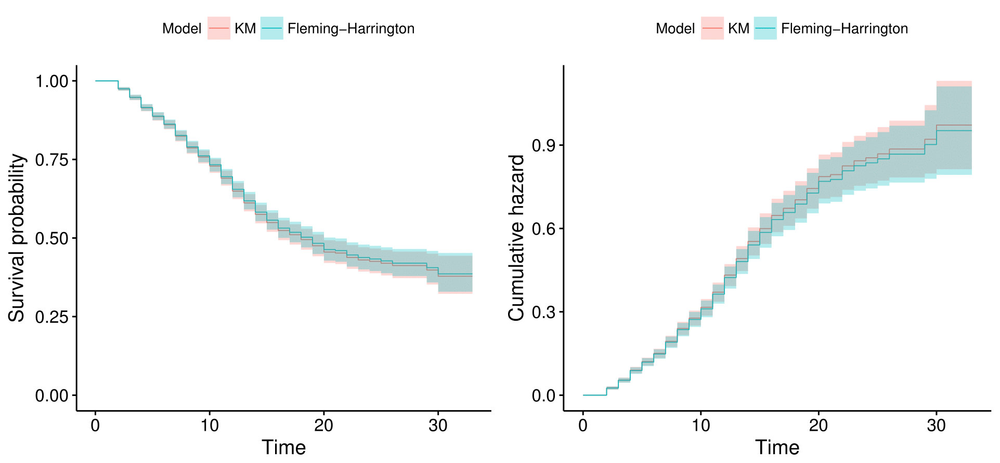

[](http://quantlet.de/)

## [](http://quantlet.de/) **NonPara_Curves** [](http://quantlet.de/)
```yaml
Name of QuantLet : NonPara_Curves

Published in : SPL

Description : 'Function producing Kaplan-Meier and Fleming-Harrington estimators for 
	       survival function and hazard function at a 95% confidence interval.'
	      
Keywords : 'survival analysis, non-parametric estimation, cumulative hazard, 
            survival function, Kaplan Meier, Fleming Harrington, R'

Author : Alice Drube, Konstantin Göbler, Chris Kolb, Richard v. Maydell

```



### R Code

```R

rm(list = ls())

# set working directory setwd('C:/...') 
# setwd('~/...') # linux/mac os
# setwd('/Users/...') # windows


# install and load packages
libraries = c("survival", "rms", "survminer", "dplyr", "readr", "ggplot2")
lapply(libraries, function(x) if (!(x %in% installed.packages())) {
   install.packages(x)
})
lapply(libraries, library, quietly = TRUE, character.only = TRUE)

# load dataset
load("datfinal.RDA")

#### Function for Kaplan Meier Curves by Strata ####

###############################################################################
##Comparison Kaplan-Meier & Nelson-Aalen/Fleming-Harrington ###################
###############################################################################

# Kaplan-Meier estimator
km.fit = survfit(Surv(time, event, type = "right") ~ 1, data = dat, 
   type = "kaplan-meier")

# Fleming-Harrington estimator
fh.fit = survfit(Surv(time, event, type = "right") ~ 1, data = dat,
    type = "fleming-harrington")
kmfh.all = list(km.fit, fh.fit)

#### Function for ggsurvplot_combine ##### store survplot object and choose
# functional argument (default is Survival Function)

nonparametricKurves = function(fun = NULL) {
   ggsurvplot_combine(kmfh.all, data = dat, conf.int = T, legend.labs = c("KM", 
   "Fleming-Harrington"), legend.title = "Model", fun = fun, risk.table = F, 
   cumcensor = FALSE, censor = FALSE, linetype = c(1, 1), size = 0.3)
}

# Survival Function
surv.all = nonparametricKurves()

# Cumulative Hazard Function
cumhaz.all = nonparametricKurves("cumhaz")

# put all plots in one graph
kmfh.glist = list(surv.all, cumhaz.all)
arrange_ggsurvplots(kmfh.glist, print = TRUE, ncol = 2, nrow = 1)

```
