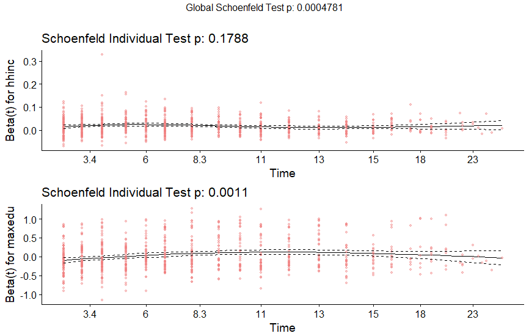
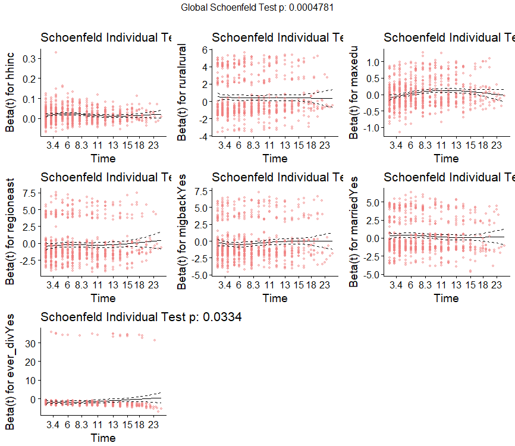

[](http://quantlet.de/)
## [](http://quantlet.de/) **Schoenf_IndivTest** [](http://quantlet.de/)
```yaml

Name of QuantLet : Schoenf_IndivTest

Published in : SPL

Description : 'Graphical diagnostic checking of the PH assumption (test the null hypothesis of 
	       proportional hazards) - plot them against time'

Keywords : 'survival analysis, non-parametric estimation, semi-parametric estimation, 
            hazard rate, Kaplan Meier, R'

Author : Alice Drube, Konstantin Göbler, Chris Kolb, Richard v. Maydell

```





### R Code

```R


rm(list = ls())

# set working directory setwd('C:/...') 
# setwd('~/...') # linux/mac os
# setwd('/Users/...') # windows

# load packages
libraries = c("survival", "rms", "survminer", "stargazer", "reporttools", "dplyr", 
   "readr", "flexsurv", "ggfortify", "ggplot2")
lapply(libraries, function(x) if (!(x %in% installed.packages())) {
   install.packages(x)
})
lapply(libraries, library, quietly = TRUE, character.only = TRUE)


load("datfinal.RDA")


###############################################################################
########### Cox Proportional Hazards Regression################################

# survival package to estimate models, survminer package for plots and
# diagnostics

# define survival object
coxsurv = Surv(dat$time, dat$event, type = "right")

# define formula
coxform = as.formula("coxsurv ~ hhinc + rural + maxedu + region + migback + 
   married + ever_div")

# estimate Cox regression
cox.ph = coxph(coxform, data = dat)
summary(cox.ph)

# Cox PH model table
stargazer(cox.ph)
displayCoxPH(cox.ph, p = "", dig.coef = 3, dig.p = 2)

# table in overleaf is constructed from both outputs


# Forest plot of results
dat = within(dat, {
   rural = factor(rural, labels = c("urban", "rural"))
   region = factor(region, labels = c("west", "east"))
   migback = factor(migback, labels = c("No", "Yes"))
   married = factor(married, labels = c("No", "Yes"))
   ever_div = factor(ever_div, labels = c("No", "Yes"))
})
cox.ph = coxph(coxform, data = dat)


###############################################################################
########### Cox Model Diagnostics##############################################
###############################################################################


# Schoenfeld test
coxtest = cox.zph(cox.ph, transform = "km")
coxtest
stargazer(coxtest$table, out = "schoenfeld.tex")

# Schoenfeld graphical test of cox ph assumption

# scaled Schoenfeld plots for two selected variables
ggcoxzph(coxtest, resid = T, point.col = "lightcoral", point.alpha = 0.4, 
    var = c("hhinc", "maxedu"))

# scaled Schoenfeld plots for all variables
ggcoxzph(coxtest, point.alpha = 0.4, point.col = "lightcoral")


```
