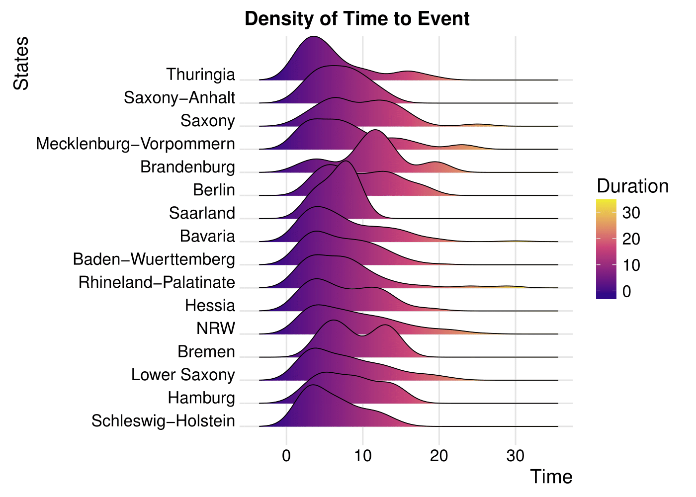

[](http://quantlet.de/)

## [](http://quantlet.de/) **SurvivalDens** [](http://quantlet.de/)
```YAML
Name of QuantLet : SurvivalDens

Published in : SPL

Description : 'Compare the distribution of survival times - 
	       Survival Times by Federal State'     
              
Keywords : 'survival analysis, non-parametric estimation, semi-parametric estimation, 
            hazard rate, density estimation, Kaplan Meier, R'

Author : Alice Drube, Konstantin Göbler, Chris Kolb, Richard v. Maydell
```


### R Code 
```R
rm(list = ls())

# set working directory setwd('C:/...') 
# setwd('~/...') # linux/mac os
# setwd('/Users/...') # windows

# load packages
libraries = c("survival", "rms", "survminer", "dplyr", "ggridges", "ggplot2")
lapply(libraries, function(x) if (!(x %in% installed.packages())) {
  install.packages(x)
})
lapply(libraries, library, quietly = TRUE, character.only = TRUE)

# load dataset
load("datfinal.RDA")


###############################################################################
#### Density plots by federal states ##########################################
###############################################################################

#### distribution of time to event by state ###
dist = subset(dat, event == 1)
dist$yeargroup = as.factor(dist$firstyear)
levels(dist$state)
hist(dist$time)

ggplot(dist, aes(x = dist$time, y = dist$state, fill = dist$state)) + 
  geom_density_ridges_gradient(aes(fill = ..x..), scale = 2.5, size = 0.3) +
  scale_fill_gradientn(colours = c("#0D0887FF", "#CC4678FF", "#F0F921FF"), 
                       name = "Duration") + 
  theme_ridges() + 
  labs(title = "Density of Time to Event", x = "Time", y = "States")


rm(dist)

```
